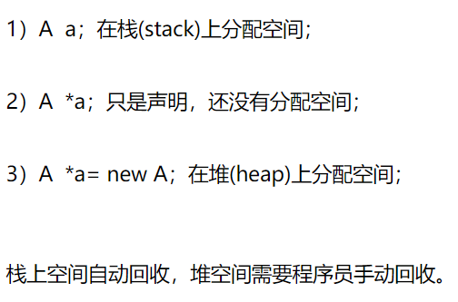

# Merge Two Sorted Lists

## C++

### 指针，对象使用

### 初始化对象时用\*和不用的区别



```text
#include <iostream>
using namespace std;

struct ListNode
{
    int val;
    ListNode *next;
    ListNode(int x) : val(x), next(NULL) {}
};

class Solution
{
  public:
    ListNode *mergeTwoLists(ListNode *l1, ListNode *l2)
    {
        ListNode result(0);
        ListNode *current_node = &result;
        while (l1 != NULL && l2 != NULL)
        {
            cout << "not null" << endl;
            if (l1->val < l2->val)
            {
                current_node->next = l1;
                current_node = current_node->next;
                l1 = l1->next;
            }
            else
            {
                current_node->next = l2;
                current_node = current_node->next;
                l2 = l2->next;
            }
        }
        if (l1 != NULL)
        {
            while (l1 != NULL)
            {
                current_node->next = l1;
                current_node = current_node->next;
                l1 = l1->next;
            }
        }
        else
        {
            while (l2 != NULL)
            {
                current_node->next = l2;
                current_node = current_node->next;
                l2 = l2->next;
            }
        }
        return result.next;
    }
};

int main()
{
    ListNode *l1 = new ListNode(-1);
    ListNode *l2 = new ListNode(-1);
    ListNode ln11(1), ln12(2), ln13(4);
    ListNode ln21(1), ln22(3), ln23(4);
    l1->next = &ln11;
    ln11.next = &ln12;
    ln12.next = &ln13;
    ln13.next = NULL;
    l2->next = &ln21;
    ln21.next = &ln22;
    ln22.next = &ln23;
    ln23.next = NULL;
    cout << "start!" << endl;
    Solution *s = new Solution();
    ListNode *result = s->mergeTwoLists(l1->next, l2->next);
    while (result)
    {
        cout << result->val;
        result = result->next;
    }
    cout << "end" << endl;
    delete s;
    system("pause");
    return 0;
}
```

```text
class Solution
{
  public:
    ListNode *mergeTwoLists(ListNode *l1, ListNode *l2)
    {
        ListNode result(INT_MIN);
        ListNode *temp = &result;

        while (l1 && l2)
        {
            if (l1->val < l2->val)
            {
                temp->next = l1;
                l1 = l1->next;
            }
            else
            {
                temp->next = l2;
                l2 = l2->next;
            }
            temp = temp->next;
        }
        temp->next = l1 ? l1 : l2;
        return result.next;
    }
};
```

## python

```text
class Solution:
    def mergeTwoLists(self, l1, l2):
        """
        :type l1: ListNode
        :type l2: ListNode
        :rtype: ListNode
        """
        if not l1: return l2
        if not l2: return l1
        result = ListNode(-1)
        cur = result

        while(l1 and l2):
            if(l1.val<l2.val):
                cur.next = l1
                l1 = l1.next
            else:
                cur.next = l2
                l2 = l2.next
            cur = cur.next
        cur.next = l1 or l2
        return head.next
```

